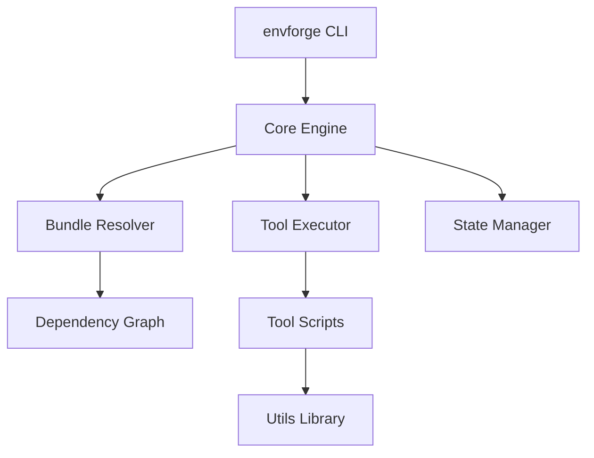
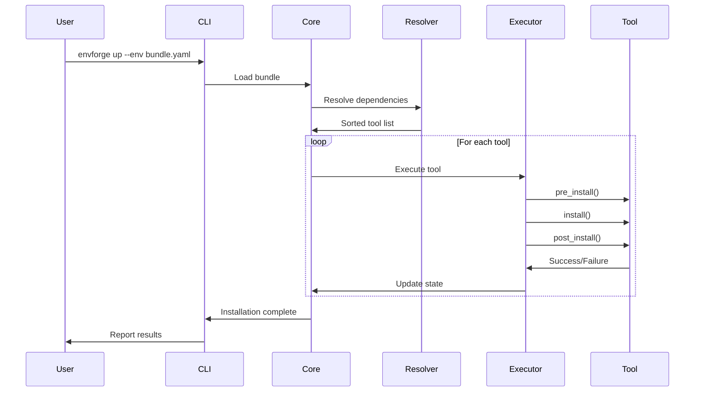

# Architecture Overview

EnvForge is built on a modular architecture that separates concerns and enables flexible, dependency-aware installations.

## Core Components



### 1. CLI Entry Point (`envforge`)

The main executable that provides the user interface:

- Parses command-line arguments
- Routes to appropriate subcommands (`up`, `version`, `upgrade`)
- Handles global options and flags

### 2. Core Engine (`lib/core.sh`)

The orchestration layer that:

- Loads bundle definitions
- Coordinates dependency resolution
- Manages installation flow
- Tracks state across installations

### 3. Bundle Resolver (`lib/bundle_resolver.py`)

Python-based dependency resolution engine:

- Parses YAML bundle definitions
- Builds dependency graph
- Performs topological sorting
- Detects circular dependencies
- Outputs installation order

### 4. Tool Executor

Executes individual tool scripts with three-phase lifecycle:

1. **pre_install**: Preparation and validation
2. **install**: Actual installation logic
3. **post_install**: Verification and cleanup

### 5. Utils Library (`lib/utils.sh`)

Shared utilities for tool scripts:

- Logging functions (`log_info`, `log_success`, `log_error`)
- Package installation helpers
- Common validation functions
- State management utilities

### 6. State Manager

Tracks installation completion:

- Per-bundle state directories
- Individual tool completion markers
- Enables resume functionality
- Prevents redundant installations

## Data Flow



## Design Principles

### 1. Modularity

Each component has a single, well-defined responsibility:

- **Tools** are self-contained installation scripts
- **Bundles** are declarative definitions
- **Core** orchestrates without knowing tool details
- **Resolver** focuses only on dependency logic

### 2. Dependency Awareness

Automatic dependency resolution ensures:

- Correct installation order
- No missing prerequisites
- Circular dependency detection
- Explicit dependency declarations

### 3. Idempotency

Tools can be run multiple times safely:

- State tracking prevents re-execution
- Tools check before installing
- `--force` flag overrides when needed

### 4. Flexibility

Multiple execution modes:

- Complete bundles
- Individual tools
- Custom bundle definitions
- Standalone tool execution

### 5. Extensibility

Easy to add new capabilities:

- Drop new tools in `tools/` directory
- Create bundles in `bundles/` directory
- Tools follow simple contract
- No core modifications needed

## File Organization

```
env-forge/
├── envforge              # CLI entry point
├── bootstrap-init.sh     # Remote installation script
├── bundles/              # Bundle definitions (YAML)
│   └── default.yaml
├── tools/                # Tool installation scripts
│   ├── git.sh
│   ├── nodejs.sh
│   └── ...
├── lib/                  # Shared libraries
│   ├── utils.sh          # Bash utilities
│   ├── core.sh           # Core orchestration
│   └── bundle_resolver.py # Dependency resolver
└── .install_state/       # State tracking (created at runtime)
    └── <bundle_name>/
        ├── tool1
        └── tool2
```

## Next Steps

- [**Directory Structure**](directory-structure.md) - Detailed file organization
- [**How Scripting Works**](../scripting/how-it-works.md) - Understanding the scripting system
- [**Creating Tools**](../scripting/creating-tools.md) - Build your own tools
