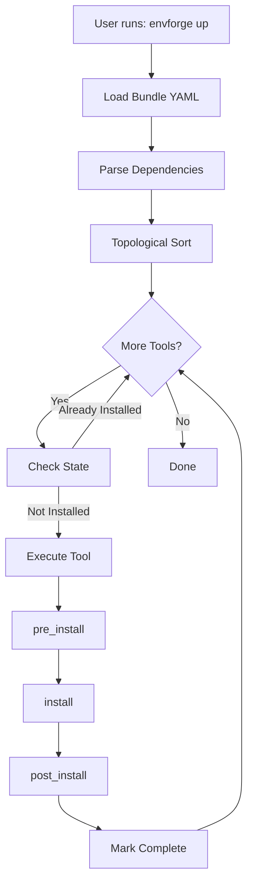

# How the Scripting System Works

EnvForge's scripting system is designed around simplicity and flexibility. Understanding how it works will help you create custom tools and bundles.

## Execution Flow



## Three-Phase Lifecycle

Every tool script implements three phases:

### 1. pre_install

**Purpose**: Preparation and validation

**Typical tasks**:
- Check if tool is already installed
- Validate prerequisites
- Log what will be installed
- Download resources
- Backup existing configurations

**Example**:
```bash
pre_install() {
    log_info "Checking for Node.js..."
    
    if command -v node &> /dev/null; then
        log_info "Node.js already installed: $(node --version)"
    fi
}
```

### 2. install

**Purpose**: Actual installation

**Typical tasks**:
- Install packages
- Download and extract archives
- Compile from source
- Configure applications
- Create symlinks

**Example**:
```bash
install() {
    log_info "Installing Node.js..."
    install_apt_packages "${apt_packages[@]}"
}
```

### 3. post_install

**Purpose**: Verification and cleanup

**Typical tasks**:
- Verify installation success
- Run post-install configuration
- Clean up temporary files
- Display version information
- Exit with error if verification fails

**Example**:
```bash
post_install() {
    if command -v node &> /dev/null; then
        log_success "Node.js installed: $(node --version)"
        log_success "npm installed: $(npm --version)"
    else
        log_error "Node.js installation failed"
        exit 1
    fi
}
```

## Dependency Resolution

EnvForge uses a Python-based resolver to handle dependencies.

### How It Works

1. **Parse Bundle**: Read YAML and extract tool definitions
2. **Build Graph**: Create dependency graph from `depends_on` declarations
3. **Detect Cycles**: Check for circular dependencies
4. **Topological Sort**: Order tools so dependencies install first
5. **Return Order**: Provide sorted list to core engine

### Example

Given this bundle:

```yaml
tools:
  - vscode:
      depends_on:
        - nodejs
  - nodejs:
      depends_on:
        - build-essential
  - build-essential:
```

The resolver produces:
```
1. build-essential
2. nodejs
3. vscode
```

### Circular Dependency Detection

If you create a cycle:

```yaml
tools:
  - tool-a:
      depends_on: [tool-b]
  - tool-b:
      depends_on: [tool-a]
```

EnvForge will detect and report the error:
```
Error: Circular dependency detected: tool-a -> tool-b -> tool-a
```

## State Management

State tracking enables idempotent installations.

### How State Works

1. **Check State**: Before executing a tool, check `.install_state/<bundle>/<tool>`
2. **Skip if Exists**: If marker exists, skip execution
3. **Execute if Missing**: If marker missing, run tool
4. **Mark Complete**: After successful execution, create marker file

### State File Location

```
.install_state/
└── <bundle_name>/
    └── <tool_name>    # Empty marker file
```

### Force Re-execution

Override state with `--force`:

```bash
envforge up --force
```

This ignores all state markers and re-runs everything.

## Tool Script Anatomy

### Minimal Tool Script

```bash
#!/bin/bash

# Source utilities
SCRIPT_DIR="$(cd "$(dirname "${BASH_SOURCE[0]}")" && pwd)"
PROJECT_ROOT="$(dirname "$SCRIPT_DIR")"
source "$PROJECT_ROOT/lib/utils.sh"

# Define what to install
apt_packages=("git")

# Three phases
pre_install() {
    log_info "Installing Git..."
}

install() {
    install_apt_packages "${apt_packages[@]}"
}

post_install() {
    if command -v git &> /dev/null; then
        log_success "Git installed: $(git --version)"
    else
        log_error "Git installation failed"
        exit 1
    fi
}

# Standalone execution
if [[ "${BASH_SOURCE[0]}" == "${0}" ]]; then
    pre_install
    install
    post_install
fi
```

### Standalone Execution

The final block enables running tools independently:

```bash
# Run directly
./tools/git.sh

# Or via bundle
envforge up --env bundle.yaml
```

## Utility Functions

EnvForge provides helper functions in `lib/utils.sh`:

### Logging

```bash
log_info "Information message"
log_success "Success message"
log_error "Error message"
log_warning "Warning message"
```

### Package Installation

```bash
# Install APT packages
install_apt_packages "package1" "package2"

# Install with PPA
add_ppa "ppa:repository/name"
install_apt_packages "package"
```

### Path Management

```bash
# Add directory to PATH
add_to_path "/path/to/directory"
```

### Validation

```bash
# Check if command exists
if command -v node &> /dev/null; then
    echo "Node.js is installed"
fi
```

## Error Handling

Tools should exit with non-zero status on failure:

```bash
post_install() {
    if ! command -v mytool &> /dev/null; then
        log_error "Installation failed"
        exit 1
    fi
}
```

This stops bundle execution and reports the error.

## Next Steps

- [**Creating Tools**](creating-tools.md) - Build your own tools
- [**Creating Bundles**](creating-bundles.md) - Define custom bundles
- [**Customization Guide**](../customization/overview.md) - Advanced customization
